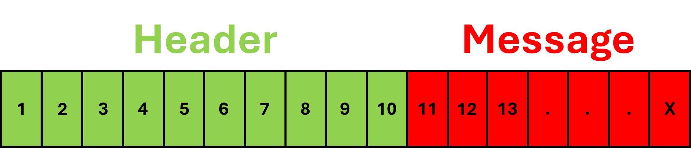
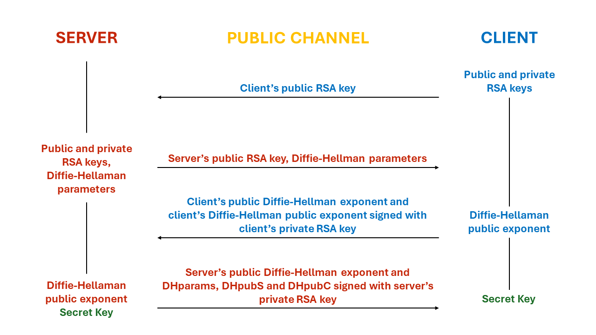
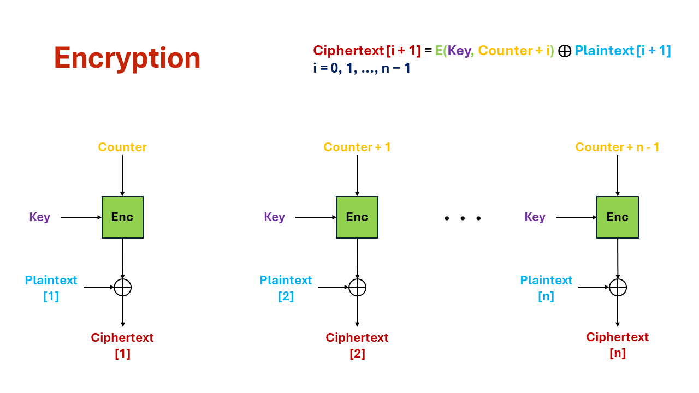
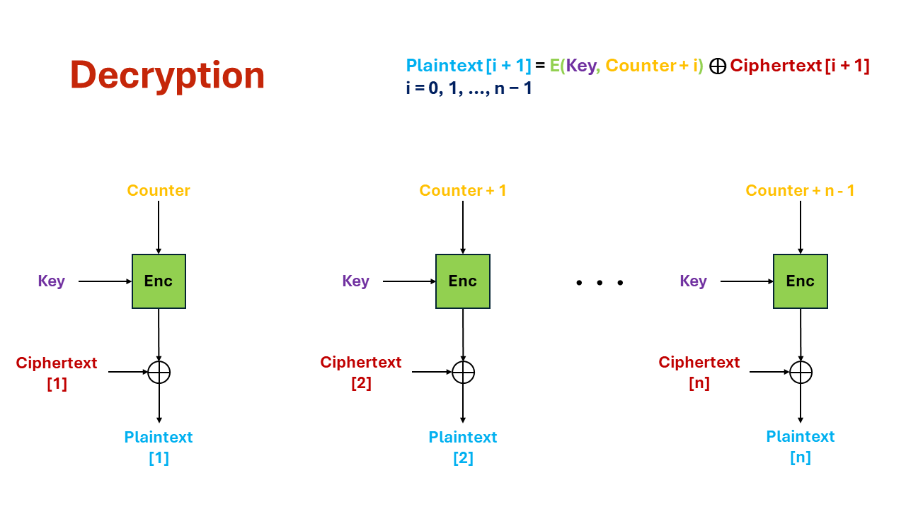
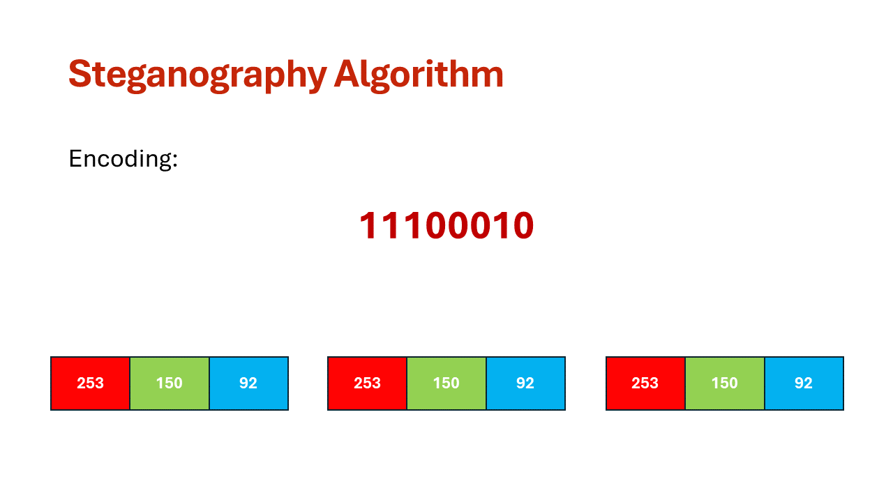
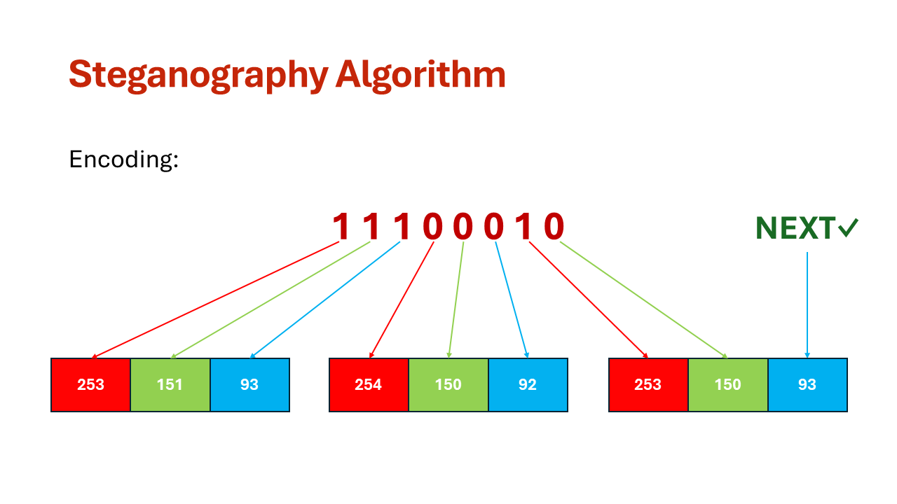
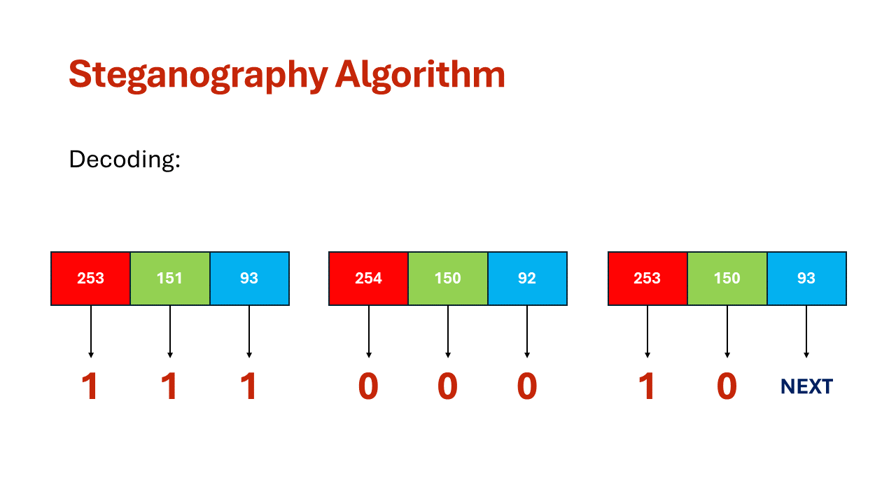
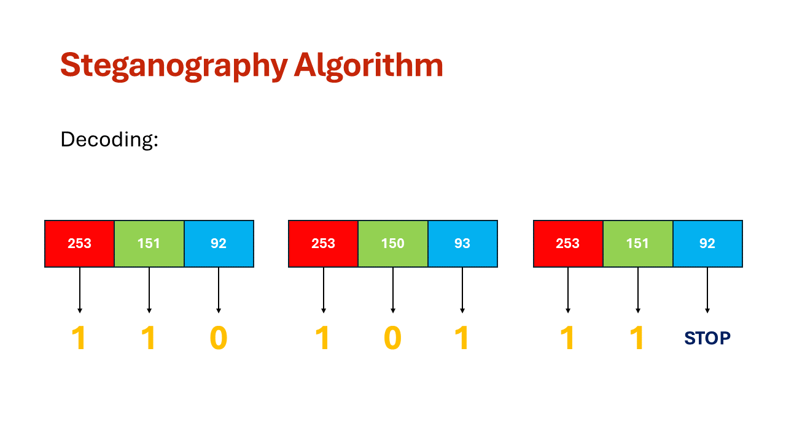

# Steganografija

# 1. Uvod

**Steganografija** je znanstvena disciplina koja se bavi prikrivenom razmjenom informacija. Riječ steganografija izvedena je od grčkih riječi _steganos_ i _graphein_, što u doslovnom prijevodu znači "skriveno pisanje". Osnovni princip steganografije počiva na prikrivanju samog postojanja informacije koja se prenosi unutar nekog naizgled bezazlenog medija ili skupa podataka. Moderna steganografija, koja koristi prednosti digitalne tehnologije, najčešće podrazumijeva skrivanje tajne poruke unutar neke multimedijske datoteke, npr. slike, audio ili video datoteke. Multimedijske datoteke u pravilu sadrže neupotrijebljene ili nevažne podatkovne prostore koje različite steganografske tehnike koriste tako da ih popune s tajnim informacijama. Takve datoteke se potom mogu razmjenjivati bez da itko bude svjestan prave svrhe dotične komunikacije.


Steganografija

Steganografija ima vrlo široke mogućnosti primjene - od prikrivene razmjene podataka u privatne i poslovne svrhe pa sve do zaštite autorskih prava u obliku vodenog pečata. No, zbog svog temeljnog principa "nevidljivosti" informacija, često se koristi i tijekom ilegalnih aktivnosti. Steganografija podrazumijeva prikrivanje tajne poruke, ali ne i činjenice da dvije strane međusobno komuniciraju. Stoga proces steganografije obično uključuje umetanje tajne poruke unutar nekog prijenosnog medija koji se u tom slučaju naziva **nositelj** i ima ulogu prikrivanja postojanja tajne poruke. Nositelj mora biti takav skup podataka koji je sastavni dio uobičajene svakodnevne komunikacije te kao takav ne privlači posebnu pozornost na sebe, npr. tekst, slika, audio ili video zapis. Cjelina sačinjena od tajne poruke i nositelja unutar kojeg je ta poruka ugniježđena, naziva se **steganografski medij**. U svrhu dodatne zaštite, moguća je i uporaba **steganografskog ključa** kojim se tajna poruka kriptira prije umetanja u nositelja.

Zadatak ovog projekta bio je razviti vlastiti **steganografski algoritam** pomoću kojeg se poruka enkodira unutar slike te se uspješno dekodira iz slike. Komunikacija između dva entiteta je zamišljena da se odvija preko soket veze. Također je trebalo osigurati da se entiteti dogovore oko zajedničke tajne (ključa) koju bi potom koristili prilikom enkripcije i dekripcije poruke.

### Osnovni ciljevi projekta su:

- Koristiti **RSA** kriptosustav za izradu certifikata
- Uspostaviti steganografski ključ korištenjem **Diffie-Hellman** metode
- Enkripcija tajne poruke korištenjem **AES-CTR** algoritma
- Razmjena steganografskog medija preko **soketa**

# 2. Komunikacija preko soketa

Za razmjenu poruke, odnosno, steganografskog medija između dva entiteta korištena je soket komunikacija. Za uspostavu komunikacije preko soketa korišten je _python_ biblioteka **_socket_**. Definirana je **IP adresa** kao i pripadajući **port**.

```python
IP = socket.gethostname()
PORT = 1234
```

Također je definirana i veličina zaglavlja. Više o značenju zaglavlja u nastavku.

```python
HEADER_LENGTH = 10
```

Razmjena informacija između servera i klijenta funkcionira na način da se unutar poruke koja se šalje enkapsulira **zaglavlje** (veličine 10 bajtova) koje sadrži informaciju o **veličini poruke** koja mu slijedi. Na taj način, ona strana koja prima poruku prvo primi 10 bajtova informacije, a zatim primi onoliko bajtova koliko je bilo zapisano u prvih 10 bajtova. U nastavku je prikazano primljanje poruke od druge strane te je prikazan format informacije koja se razmjenjuje.

```python
    message_header = client_socket.recv(HEADER_LENGTH)

    if not len(message_header):
            return False

    message_length = int(message_header.decode("utf-8").strip())
    message = client_socket.recv(message_length)
```



Format informacije koja se šalje

# 3. Protokol za uspostavu steganografskog ključa

Protokol implementira **Diffie-Hellman** **key exchange protokol i omogućava uspostavu dijeljenog steganografskog ključa između dva entiteta (klijent i server). Protokol koristi **RSA\*\* kriptosustav za zaštitu integriteta Diffie-Hellman javnih ključeva.

Popis oznaka u protokolu:

| Oznaka          | Opis                                                        |
| --------------- | ----------------------------------------------------------- | --- | ------------------------------------- |
| C               | klijent                                                     |
| S               | server                                                      |
| RSApriv, RSApub | privatni i javni RSA ključevi                               |
| DHpriv, DHpub   | privatni i javni DH ključevi                                |
| DHparams        | javni DH parametri: prime modulus (p) i group generator (g) |
| Sig(RSApriv, m) | RSA digitalno potpisana poruka m                            |
| a               |                                                             |  b  | konkatenacija (spajanje) poruka a i b |

### Protokol

| Tko šalje | Poruka koja se šalje |
| --------- | -------------------- | --- | ------------------------ | --- | ------- | --- | ------- |
| C → S     | RSApubC              |
| S → C     | RSApubS, DHparams    |
| C → S     | DHpubC               |     |  Sig(RSAprivC, DHpubC)   |
| S → C     | DHpubS               |     |  Sig(RSAprivS, DHparams  |     | DHpubS  |     | DHpubC) |

**Steganografski ključ** se dobije po formuli:

$$
(g^x)^y \space mod \space p
$$



Protokol za uspostavu steganografskog ključa

## Kod

### Generiranje privatnog RSA ključa

```python
def generate_RSA_private_key():
    RSA_private_key = rsa.generate_private_key(
        public_exponent=65537,
        key_size=2048,
    )

    RSA_private_key = RSA_private_key.private_bytes(
        encoding=serialization.Encoding.PEM,
        format=serialization.PrivateFormat.TraditionalOpenSSL,
        encryption_algorithm=serialization.NoEncryption()
    )

    RSA_private_key_decoded = RSA_private_key.decode()

    print(f"RSA private key:\n {RSA_private_key_decoded}")

    return RSA_private_key
```

### Generiranje javnog RSA ključa

```python
def generate_RSA_public_key(RSA_private_key):
    RSA_private_key = serialization.load_pem_private_key(
        RSA_private_key,
        password=None
    )

    RSA_public_key = RSA_private_key.public_key()
    RSA_public_key = RSA_public_key.public_bytes(
        encoding=serialization.Encoding.PEM,
        format=serialization.PublicFormat.SubjectPublicKeyInfo
    )

    RSA_public_key_decoded = RSA_public_key.decode()

    print(f"RSA public key:\n {RSA_public_key_decoded}")

    return RSA_public_key
```

### Generiranje Diffie-Hellman parametara

```python
def generate_DH_parameters():
    DH_parameters = dh.generate_parameters(generator=2, key_size=2048)

    g = DH_parameters.parameter_numbers().g
    p = DH_parameters.parameter_numbers().p

    DH_parameters = DH_parameters.parameter_bytes(
        encoding=serialization.Encoding.PEM,
        format=serialization.ParameterFormat.PKCS3
    )

    DH_parameters_decoded = DH_parameters.decode()

    print(f"Diffie-Hellman parameters:\n{DH_parameters_decoded}\ng -> {g}\np -> {p}\n")

    return DH_parameters
```

### Generiranje privatnog Diffie-Hellman ključa

```python
def generate_DH_private_key(DH_parameters):
    DH_private_key = DH_parameters.generate_private_key()

    DH_private_key_bytes = DH_private_key.private_bytes(
        encoding=serialization.Encoding.PEM,
        format=serialization.PrivateFormat.PKCS8,
        encryption_algorithm=serialization.NoEncryption()
    ).decode()

    print(f"Diffie-Hellman private key:\n{DH_private_key_bytes}")

    return DH_private_key
```

### Generiranje javnog Diffie-Hellman ključa

```python
def generate_DH_public_key(DH_private_key):
    DH_public_key = DH_private_key.public_key()

    DH_public_key = DH_public_key.public_bytes(
        encoding=serialization.Encoding.PEM,
        format=serialization.PublicFormat.SubjectPublicKeyInfo
    )

    DH_public_key_decoded = DH_public_key.decode()

    print(f"Diffie-Hellman public key:\n{DH_public_key_decoded}")

    return DH_public_key
```

### Potpisivanje serverskog certifikata

```python
def sign_key_client_to_server(RSA_private_key, DH_public_key):
    RSA_private_key = serialization.load_pem_private_key(
        RSA_private_key,
        password=None
    )

    client_signature = RSA_private_key.sign(
        DH_public_key,
        padding.PSS(
            mgf=padding.MGF1(hashes.SHA256()),
            salt_length=padding.PSS.MAX_LENGTH
        ),
        hashes.SHA256()
    )

    client_signature_base64 = base64.b64encode(client_signature)

    client_signature_decoded = client_signature_base64.decode()

    print(f"Client signature:\n{client_signature_decoded}\n")

    return client_signature_base64;
```

### Potpisivanje klijentskog certifikata

```python
def sign_key_server_to_client(RSA_private_key, DH_parameters, server_DH_public_key, client_DH_public_key):
    RSA_private_key = serialization.load_pem_private_key(
        RSA_private_key,
        password=None
    )

    client_DH_public_key = client_DH_public_key.encode()

    message = DH_parameters + server_DH_public_key + client_DH_public_key

    server_signature = RSA_private_key.sign(
        message,
        padding.PSS(
            mgf=padding.MGF1(hashes.SHA256()),
            salt_length=padding.PSS.MAX_LENGTH
        ),
        hashes.SHA256()
    )

    server_signature_base64 = base64.b64encode(server_signature)

    server_signature_decoded = server_signature_base64.decode()

    print(f"Server signature:\n{server_signature_decoded}\n")

    return server_signature_base64;
```

### Generiranje steganografskog ključa

```python
def get_key(private_key, public_key):
    public_key = public_key.encode()
    public_key = serialization.load_pem_public_key(public_key)

    DH_shared_key = private_key.exchange(public_key)

    derived_key = HKDF(
        algorithm=hashes.SHA256(),
        length=32,
        salt=None,
        info=b'handshake data',
    ).derive(DH_shared_key)

    derived_key = base64.b64encode(derived_key).decode()

    return derived_key
```

# 4. Enkripcija tajne poruke AES-CTR enkripcijskim algoritmom

*“Counter (CTR) encryption mode* **probabilistički** je način enkripcije poruka, gdje se *plaintext* enkriptira jednostavnom *xor* operacijom s generiranim *pseudo-slučajnim* nizom ključeva (_pseudorandom key stream_). Pseudo-slučajan niz ključeva generira se na način da se danom blok šiftom (npr. AES) enkriptiraju sukcesivne vrijednosti brojača (_counter_).” — Mario Čagalj

Na priloženoj slici je prikazan rad **CTR** enkripcijskog moda:



Enkripcija u CTR modu



Dekripcija u CTR modu

Razlog korištenja CTR moda leži u tome što je CTR mode **\*block** cipher\* koji se ponaša kao **\*stream** cipher\*, a to znači da ćemo na izlazu imati isti broj bitova kao što je bio na ulazu. Ovo je iznimno važno zbog načina na koji se poruka enkodira unutar nositelja.

## Kod

### Enkripcija poruke

```python
def encrypt_message(message, key):
    if isinstance(key, str):
        key = base64.b64decode(key)

    message = bitstring_to_bytes(message)
    iv = generate_iv(key=key)

    backend = default_backend()

    cipher = Cipher(algorithms.AES(key), modes.CTR(iv), backend=backend)
    encryptor = cipher.encryptor()
    ciphertext = encryptor.update(message) + encryptor.finalize()

    ciphertext = bytes_to_bitstring(ciphertext)

    return ciphertext
```

### Dekripcija poruke

```python
def decrypt_message(ciphertext, key):
    if isinstance(key, str):
        key = base64.b64decode(key)

    ciphertext = bitstring_to_bytes(ciphertext)
    iv = generate_iv(key=key)

    backend = default_backend()

    cipher = Cipher(algorithms.AES(key), modes.CTR(iv), backend=backend)
    decryptor = cipher.decryptor()
    plaintext = decryptor.update(ciphertext) + decryptor.finalize()

    plaintext = bytes_to_bitstring(plaintext)

    return plaintext
```

# 5. Priprema poruke

Da bi se poruka enkodirala unutar nositelja, odnosno, da bi uspješno pročitali dekodiranu informaciju iz nositelja, poruka mora proći kroz niz filtera koji je transformiraju u željeni format.

U nastavku će se detaljno objasniti obje situacije, ona situacija u kojoj poruku pripremamo za enkodiranje, kao i ona situacija u kojoj se dekodirana informacija transformira u čovjeku čitljiv oblik.

## 5.1 Transformacija izvorne poruke u format pogodan za enkodiranje

Server odabere koju će poruku poslati klijentu. Poruka se pretvori u binarni string na način da se ASCII vrijednost svakog znaka poruke zasebno pretvori u njegovu binarnu vrijednost.

Na primjer, ASCII vrijednost znaka “H” je 72, a njegova binarna vrijednost je 01001000. Pa se tako poruka **“Hello!”** pretvori u binarni string i to po uzroku:
”H” → ASCII 72 → **01001000**

”e” → ASCII 101 → **01100101**

”l” → ASCII 108 → **01101100**

”l” → ASCII 108 → **01101100**

”o” → ASCII 111 → **01101111**

”!” → ASCII 33 → **00100001**

U konačnici, binarni string je **“010010000110010101101100011011000110111100100001”**.

### Pretvorba poruke u binarni string

```python
def message_to_ascii_binary_strings(message):
    binary_string = ''.join([bin(ord(char))[2:].zfill(8) for char in message])
    return binary_string
```

Zatim se navedeni binarni string pretvori u bajtove kako bi se mogao enkriptirati u **AES-CTR modu**.

Enkripcijom se dobije niz bajtova koji onda moraju proći reverzabilan proces pretvorbe bajtova u binarni string. U konačnici bi se trebao dobiti nasumični string bitova iste duljine kao onaj string koji se dobio pretvorbom poruke u binarni string - **“101101010110111011110011010111011101111101001100”**.

### Pretvorba binarnog stringa u bajtove

```python
def bitstring_to_bytes(bitstring):
    bitstring = bitstring.zfill(8 * ((len(bitstring) + 7) // 8))
    return int(bitstring, 2).to_bytes((len(bitstring) + 7) // 8, byteorder='big')
```

### Pretvorba bajtova u binarni string

```python
def bytes_to_bitstring(byte_array):
    return ''.join(format(byte, '08b') for byte in byte_array)
```

Sljedeći korak je grupiranje stringa u grupe od 8 bitova. Ovo je važno za steganografski algoritam jer se svaki znak (8 bitova) enkodira u različite piksele. Kasnije se grupe od po 8 bitova dodatno grupiraju u matricu koja se sastoji od lista cjelobrojnih vrijednosti (nula i jedinica). Svaka lista ima 8 elemenata. Ovakva matrica predstavlja željeni format koji se koristi prilikom enkodiranja poruke unutar slike.

Dakle, u prvom spomenutom koraku se dobije sljedeći oblik informacije:

**[”10110101”, “01101110”, “11110011”, “01011101”, “11011111”, “01001100”]**

Dok se u drugom koraku dobije sljedeći oblik:

**[**

**[1, 0, 1, 1, 0, 1, 0, 1],**

**[0, 1, 1, 0, 1, 1, 1, 0],**

**[1, 1, 1, 1, 0, 0, 1, 1],**

**[0, 1, 0, 1, 1, 1, 0, 1],**

**[1, 1, 0, 1, 1, 1, 1, 1],**

**[0, 1, 0, 0, 1, 1, 0, 0]**

**]**

### Grupiranje binarnog stringa u grupe po 8 bitova

```python
def group_binary_strings(binary_string):
    result = []

    for i in range(0, len(binary_string), 8):
        result.append(binary_string[i:i+8])

    return result
```

### Pretvorba grupiranih bitova u matricu

```python
def binary_strings_to_matrix(binary_strings):
    int_lists = [binary_string_to_int_list(binary_string) for binary_string in binary_strings]
    return int_lists

def binary_string_to_int_list(binary_string):
    return [int(bit) for bit in binary_string]
```

## 5.2 Transformacija dekodirane informacije u izvornu poruku

Iako još nije objašnjen proces enkodiranja i dekodiranja poruke u, odnosno, iz nositelja, ipak će se prvo objasniti proces slaganja informacije u onaj oblik čitiv čovjeku. Kao rezultat dekodiranja poruke korištenjem steganografskog algoritma dobit će se lista nula i jedinica (kao cjelobrojnih vrijednosti). Zadatak programa je da spomenutu informaciju transformira u poruku koju je izvorno poslao server.

Prvi korak transformacije obuhvaća pretvorbu liste u binarni string. Dakle, ako je dekodirana poruka:

**[1, 0, 1, 1, 0, 1, 0, 1, 0, 1, 1, 0, 1, 1, 1, 0, 1, 1, 1, 1, 0, 0, 1, 1, 0, 1, 0, 1, 1, 1, 0, 1, 1, 1, 0, 1, 1, 1, 1, 1, 0, 1, 0, 0, 1, 1, 0, 0]**

Prvi korak transformacije će je pretvoriti u:

**“101101010110111011110011010111011101111101001100”**

### Pretvorba liste binarnih vrijednosti u binarni string

```python
def binary_list_to_string(binary_list):
    binary_string = ''.join(str(bit) for bit in binary_list)
    return binary_string
```

Sljedeći korak je sličan onome iz prethodnog poglavlja, a to je pretvorba binarnog stringa u bajtove kako bi se informacija dekriptirala korištenjem **AES** algoritma u **CTR modu**. Zatim se dekriptirana informacija pretvara nazad u binarni string kako bi se nastavio proces transformacije u oblik čitljiv čovjeku. Nakon ovog koraka, izgled dekriptirane informacije je sljedeći:

**“010010000110010101101100011011000110111100100001”**

Sljedeći korak obuhvaća pretvorbu binarnog stringa u listu cjelobrojnih vrijednosti:

**[0, 1, 0, 0, 1, 0, 0, 0, 0, 1, 1, 0, 0, 1, 0, 1, 0, 1, 1, 0, 1, 1, 0, 0, 0, 1, 1, 0, 1, 1, 0, 0, 0, 1, 1, 0, 1, 1, 1, 1, 0, 0, 1, 0, 0, 0, 0, 1]**

### Pretvorba binarnog stringa u listu cjelobrojnih vrijednosti

```python
def binary_string_to_int_list(binary_string):
    return [int(bit) for bit in binary_string]
```

Sljedeći korak je grupiranje elemenata prethodno dobivene liste u osmorke kako bi informacija bila pogodna za prevođenje iz binarne vrijednosti u oblik čitljiv čovjeku.

**[**

**[0, 1, 0, 0, 1, 0, 0, 0],**

**[0, 1, 1, 0, 0, 1, 0, 1],**

**[0, 1, 1, 0, 1, 1, 0, 0],**

**[0, 1, 1, 0, 1, 1, 0, 0],**

**[0, 1, 1, 0, 1, 1, 1, 1],**

**[0, 0, 1, 0, 0, 0, 0, 1]**

**]**

### Grupiranje elemenata liste u osmorke

```python
def group_binary_in_list(number_of_lists, binary_code):
    matrix = []

    for i in range(number_of_lists):
        start_index = i * 8
        end_index = min((i + 1) * 8, len(binary_code))
        character = binary_code[start_index:end_index]

        matrix.append(character)

    return matrix
```

U konačnici, svaka od dobivenih osmorki se pretvori u znak prema njenoj ASCII vrijednosti. Svi znakovi zajedno tvore izvornu poruku.

01001000 → ASCII 72 → **”H”**

01100101 → ASCII 101 → **”e”**

01101100 → ASCII 108 → **”l”**

01101100 → ASCII 108 → **”l”**

01101111 → ASCII 111 → **”o”**

00100001 → ASCII 33 → **”!”**

Izvorna poruka je **“Hello!”**.

### Pretovrba informacije u izvornu poruku

```python
def ascii_binary_strings_to_message(matrix):
    message = ""

    for char_list in matrix:
        binary_string = ''.join(str(bit) for bit in char_list)
        ascii_value = int(binary_string, 2)
        message += chr(ascii_value)

    return message
```

# 6. Steganografski algoritam

U ovom poglavlju detaljno će se objasniti steganografski algoritam za enkodiranje i dekodiranje enkriptirane poruke unutar nositelja. Važno je za napomenuti kako je ovo vlastiti algoritam te je zasnovan na parnosti RGB vrijednosti piksela.

## 6.1 Algoritam za enkodiranje poruke

Kod enkodiranja poruke se koristi matrica koja je prethodno pripremljena za ovaj algoritam. Nastavno na peto poglavlje, matrica za demonstracijski primjer ima sljedeće vrijednosti:

**[**

**[1, 0, 1, 1, 0, 1, 0, 1],**

**[0, 1, 1, 0, 1, 1, 1, 0],**

**[1, 1, 1, 1, 0, 0, 1, 1],**

**[0, 1, 0, 1, 1, 1, 0, 1],**

**[1, 1, 0, 1, 1, 1, 1, 1],**

**[0, 1, 0, 0, 1, 1, 0, 0]**

**]**

Kao nositelj poruke koristi se **PNG** (**P**ortable **N**etwork **G**raphics) slika koja je definirana svojom visinom i širinom. Bitno je napraviti provjeru je li slika dovoljno velika da se poruka enkodira u nju.

### Usporedba kapaciteta slike i veličine poruke

```python
width, height = image.size

capacity = (width // 3) * height

    if (capacity < counter):
        print("The message is too large.")
        return False
```

Za enkodiranje jednog znaka unutar slike, potrebna su tri piksela. Svaki piksel ima tri vrijednosti - crvena, zelena i plava boja. Algoritam se zasniva na **parnosti** navedenih vrijednosti, a enkodiranje se vrši na način da se prolazi kroz sliku te se u svakoj iteraciji enkodira po jedan znak, odnosno, jedna osmorka sastavljena od nula i jedinica. Pri svakoj iteraciji se manipulira s tri piksela na način da se provjerava trenutna vrijednost bita iz osmorke i parnost trenutne boje trenutno promatranog piksela. **Jedinice** iz osmorke se enkodiraju u sliku tako da se vrijednost trenutne boje namjesti da je **neparna**, dok se **nule** iz osmorke enkodiraju u sliku tako da se vrijednost trenutne boje namjesti da je **parna**.

### Enkodiranje znaka

```python
if index < len(binary) and colors[j] < 255:
	if binary[index] == 0 and colors[j] % 2 == 0:
		new_colors[j] = colors[j]
	elif binary[index] == 1 and colors[j] % 2 == 0:
		new_colors[j] = colors[j] + 1
	elif binary[index] == 0 and colors[j] % 2 == 1:
		new_colors[j] = colors[j] + 1
	elif binary[index] == 1 and colors[j] % 2 == 1:
		new_colors[j] = colors[j]
```

Kako se u osmorki nalazi 8 bitova, a tri piksela imaju po 3 vrijednosti (ukupno 9), zadnja vrijednost se koristi kako bi se prilikom dekodiranja znalo je li to zadnji znak u poruci ili ih ima još za dekodirati. Ukoliko ima još znakova koje treba enkodirati, tada će posljednja vrijednost posljednjeg piksela biti **neparna**, u suprotnom - **parna**.

### Pohrana informacije o postojanju sljedećeg znaka u poruci

```python
if index + 1 == 9:
	if counter > 1:
		if new_colors[2] % 2 == 0:
			new_colors[2] += 1
	else:
		if new_colors[2] % 2 == 1:
			new_colors[2] += 1
```

Logika cijelog algoritma za enkodiranje poruke prikazana je u nastavku. U konačnici, funkcija vraća novu, izmijenjenu verziju slike.



Vrijednosti piksela prije enkodiranja



Vrijednosti piksela nakon enkodiranja

### Algoritam za enkodiranje poruke

```python
def encode_message(message, image, counter):
    width, height = image.size

    binary_counter = 0

    capacity = (width // 3) * height

    if (capacity < counter):
        print("The message is too large.")
        return False

    for y in range(height):
        for x in range(0, width, 3):
            if (x + 2 >= width) or counter == 0:
                continue

            index = 0

            binary = message[binary_counter]

            for i in range(3):
                current_x = x + i
                pixel_value = image.getpixel((current_x, y))
                colors = list(pixel_value)
                new_colors = list(colors)

                for j in range(3):
                    if index < len(binary) and colors[j] < 255:
                        if binary[index] == 0 and colors[j] % 2 == 0:
                            new_colors[j] = colors[j]
                        elif binary[index] == 1 and colors[j] % 2 == 0:
                            new_colors[j] = colors[j] + 1
                        elif binary[index] == 0 and colors[j] % 2 == 1:
                            new_colors[j] = colors[j] + 1
                        elif binary[index] == 1 and colors[j] % 2 == 1:
                            new_colors[j] = colors[j]

                    if index < 8:
                        index += 1

                    if index + 1 == 9:
                        if counter > 1:
                            if new_colors[2] % 2 == 0:
                                new_colors[2] += 1
                        else:
                            if new_colors[2] % 2 == 1:
                                new_colors[2] += 1

                image.putpixel((current_x, y), tuple(new_colors))

            counter -= 1
            binary_counter += 1

    image.save("images/copy_server.png")

    return image
```

## 6.2 Algoritam za dekodiranje poruke

Logika kod dekodiranja poruke je reverzna onoj kod enkodiranja. Klijent je primio od servera sliku. Primljena slika se obradi kroz steganografski algoritam za dekodiranje poruke na način da se prolazi kroz sliku od vrha prema dnu, s lijeva na desno. U svakoj iteraciji se dekodira po jedan znak, odnosno, po jedna osmorka sastavljena od nula i jedinica. U svakoj iteraciji se iz slike dohvaćaju po tri piksela te se provjerava svaka od tri vrijednosti (crvena, zelena i plava) pojedinog piksela. Ako je navedena vrijednost **parna**, tada se na kraj liste cijelobrojnih vrijednosti dodaje **nula**, a ako je navedena vrijednost **neparna**, tada se na kraj liste dodaje **jedinica**.

### Dekodiranje znaka

```python
for color in colors:
	if color % 2 == 0:
		binary.append(0)
	else:
		binary.append(1)
```

Deveta vrijednost koja se provjerava algoritmu daje potvrdu o nastavku, odnosno, prestanku izvođenja algoritma. Ako je navedena vrijednost **neparna** tada se algoritam **nastavlja** izvodit i u idućoj iteraciji, međutim, ako je vrijednost **parna**, onda se označava **prestanak** izvođenja algoritma.

### Dohvaćanje informacije o postojanju sljedećeg znaka u poruci

```python
if index == 9:
	if colors[2] % 2 == 1:
		binary.pop()
    continue
   else:
	   if colors[2] % 2 == 0:
	     break_all = True
	     break
```

Logika cijelog algoritma za enkodiranje poruke prikazana je u nastavku. U konačnici, funkcija vraća listu sastavljenu od cjelobrojnih vrijednosti nula i jedinica.



Dekodiranje s postojećim sljedećim znakom



Dekodiranje bez postojećeg sljedećeg znaka

### Algoritam za dekodiranje poruke

```python
def decode_message(image):
    width, height = image.size

    binary_counter = 0
    break_all = False
    binary = []

    for y in range(height):
        for x in range(0, width, 3):
            if (x + 2 >= width):
                continue

            index = 0

            for i in range(3):
                current_x = x + i
                pixel_value = image.getpixel((current_x, y))
                colors = list(pixel_value)

                for color in colors:
                    if color % 2 == 0:
                        binary.append(0)
                    else:
                        binary.append(1)

                    index += 1

                    if index == 9:
                        if colors[2] % 2 == 1:
                            binary.pop()
                            continue
                        else:
                            if colors[2] % 2 == 0:
                                break_all = True
                                break

                if break_all:
                    break

            binary_counter += 1

            if break_all:
                break

        if break_all:
            break

    binary.pop()
    return binary_counter, binary
```

# 7. Rezultat steganografskog algoritma

U konačnici, rezultat cijelog programa je da server i klijent uspješno mogu razmijeniti tajnu poruku bez da onaj tko osluškuje javni kanal može narušiti povjerljivost poruke. Čak i da napadač zna na koji način radi steganografski algoritam, on i dalje ne može saznati sadržaj poruke zato što se poruka enkodira unutar nositelja kao enkriptirana.

U prilogu je prikazana originalna slika koja je korištena kao nositelj, a uz nju je prikazana i slika koja je nastala kao produkt steganografskog algoritma.

### Original


Originalna verzija slike

### Kopija koja je nastala kao produkt steganografskog algoritma


Izmijenjena verzija slike

Unutar kopije je sadržana poruka **“Hello!”**, odnosno, **ciphertext** iz kojeg bi se dekripcijom korištenjem odgovarajućeg **steganografskog ključa** dobila poruka **“Hello!”**.

**Poveznica na source code:** [Steganography](https://github.com/nduje/Steganography)

# 8. Literatura

[CARNet - Steganografija](https://www.cis.hr/www.edicija/LinkedDocuments/CCERT-PUBDOC-2006-04-154.pdf)

[Mario Čagalj - Lab 6: A stream cipher based on a block cipher (CTR mode)](https://github.com/mcagalj/CNS-2023-24/blob/main/docs/ctr.md)

[Mario Čagalj - Lab 7: Public key cryptography (RSA, Diffie-Hellman)](https://github.com/mcagalj/CNS-2023-24/blob/main/docs/asymm.md)

[cryptography.io](https://cryptography.io/en/latest/#)
